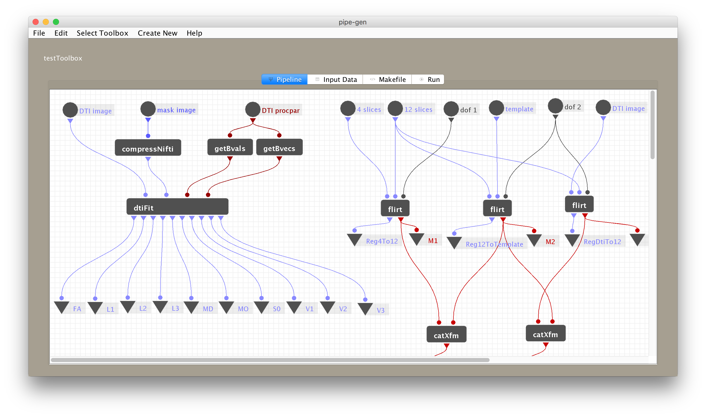

# pipe-gen
Graphical workspace for composing and running data processing pipelines.



## About

This application was developed at Gruss Magnetic Resonance Research Center to help researchers generate and run image processing pipelines for MRI data analysis.

Pipe-gen features a visual workspace where users drag-and-drop processing modules. Each data processing module represents a step in the analysis with the associated inputs depicted as mount points across the top of the module and the associated outputs across the bottom. Users then drag connection lines between modules to indicate the flow of files and other data between steps in the analysis. 

Next users load a list of input data to run through the steps of the analysis pipeline. In the previous step they described the pipeline in the abstract, as a graph of related operations. In this step users specify the exact filenames to associate with the analysis. Each item in this list either names an existing input file plugged into a *source module* or names a target output file pulled from a *sink module*. Sources are special modules that serve to pass along files from outside the pipeline as inputs to pipeline modules. Sources always have exactly one output node and no input nodes. Sinks on the other hand are special modules that name the target files produced by the pipeline. Any results files the user is interested in saving from the analysis will be represented as a sink module. Sinks always have exactly one input node and no output nodes.

Given the datasets and the relationship between analysis steps the program auto-generates a Makefile (GNU Make) to run the desired analysis. The Make scripting language describes dependency relationships between target files, input files, and the programs that should be run to produce target files. On subsequent runs of this analysis script Make will utilize the timestamps and dependency relationships between files only re-running portions of the analysis as needed.

Pipe-gen includes a run analysis dashboard. Here the user can start the Makefile running and trace if any analysis modules are failing on particular datasets.

## Requirements

- [Git](https://git-scm.com)
- [GNU Make](https://www.gnu.org/software/make)
- [Java 9](https://www.oracle.com) - Java SE 9 Development Kit (JDK)
- [Gradle 4.5](https://gradle.org)

Many commandline environments will have usable versions of Git and GNU Make out of the box. Later versions of both Java and Gradle should work for building pipe-gen, but this has not been tested extensively. Note that the Java Development Kit (JDK) is not the same as the Java Runtime Environmnet (JRE), so even if you already have the JRE you might need to install the JDK.

```
# To verify your version of Java JDK
javac -version

# To verify your version of Gradle
gradle -version
```

## Install
```
# Clone this repository
git clone https://github.com/Gruss-MRRC/pipe-gen

# Build the project with Gradle
cd ./pipe-gen
gradle build
```

## Run
```
# Change directory into your main pipe-gen folder
# The exact path will depend on where the repository was cloned 
# during the previous install step
cd ./pipe-gen

# Launch the application
./launch.sh
```

## License

The code in this repository is provided under the [MIT License](./LICENSE).
